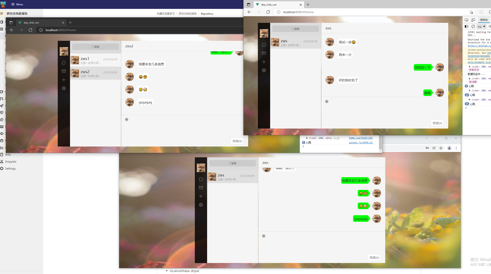
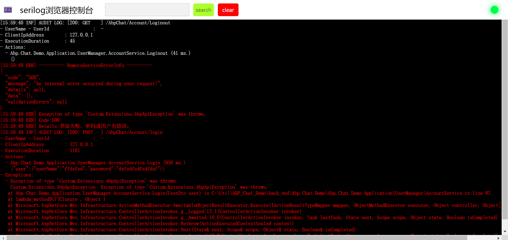

# ABP_Chat

基于ABP.Vnext框架的简单聊天项目,前端采用Vue+ElementUI，缓存使用的Redis

闲时无聊写的练手项目

# 项目结构

.jpg)

> 看着好像是使用了DDD,实际上开发时并没有遵守DDD的规范，一些基本的就不说了
>
> > 数据库创建
>
> 使用过EFCore的应该都会使用数据库迁移，这里采用的是CodeFirst，直接在Abp.Chat.Demo.EntityFrameworkCore.Migrations下面使用迁移命令即可创建数据库
>
> > Custom.Extensions
>
> 这个文件下面放着基于ABP框架的一些扩展类和一些简单的帮助类，如：动态Api，自定义全局异常处理，Jwt Token生成帮助类等
>
> > Signalr.Log.Brower
>
> 这是一个浏览器版本的serilog日志，这里只是简单的写了点东西，前端的页面放在front_end文件夹里面，这里做成了ABP模块，如果因为这个启动出错，可以直接去掉依赖特性

展示下serilog日志，前端随便写了一下，很多东西没有去完善，有兴趣的可以自己重新做一个

> 整个项目写下来其实并没什么难度，主要是做个ABP框架的学习总结，如果有好的想法，或者对ABP框架感兴趣，欢迎交流学习